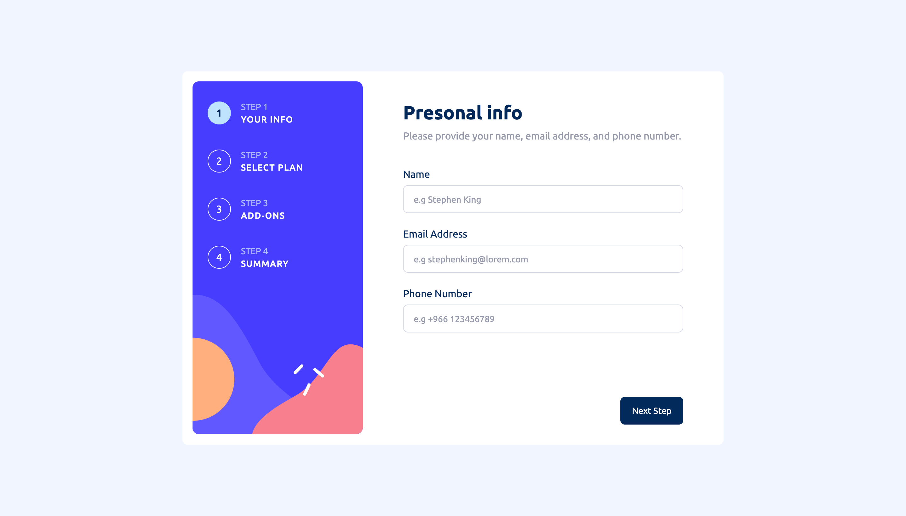
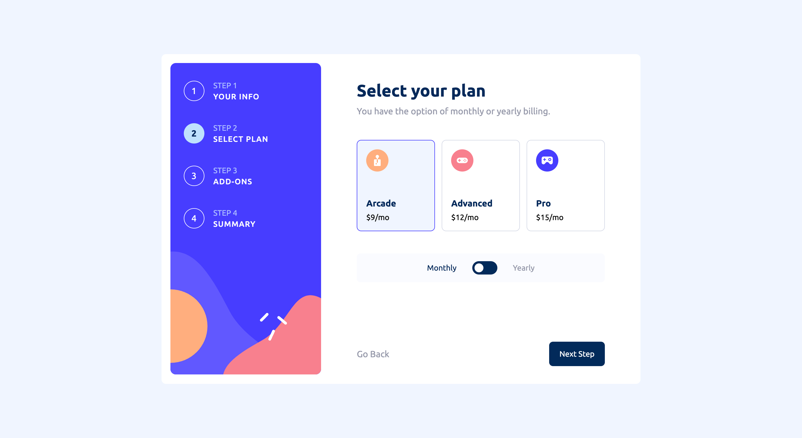
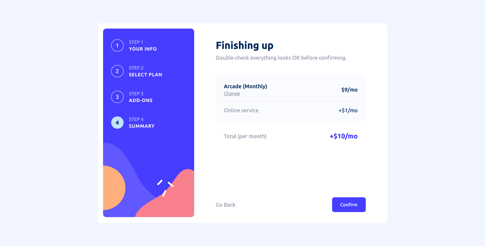
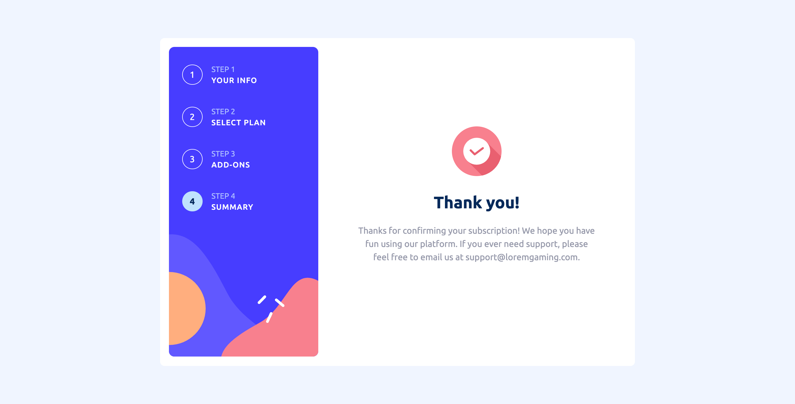
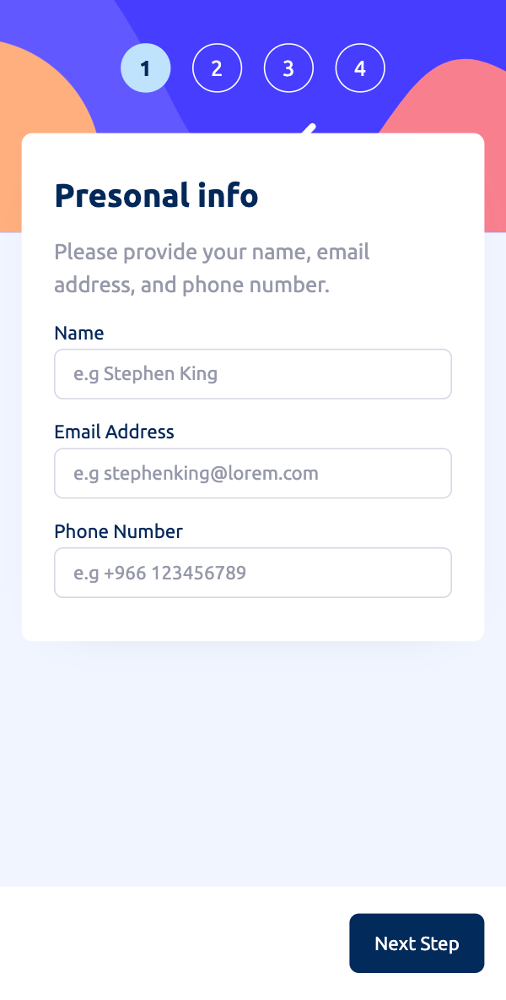
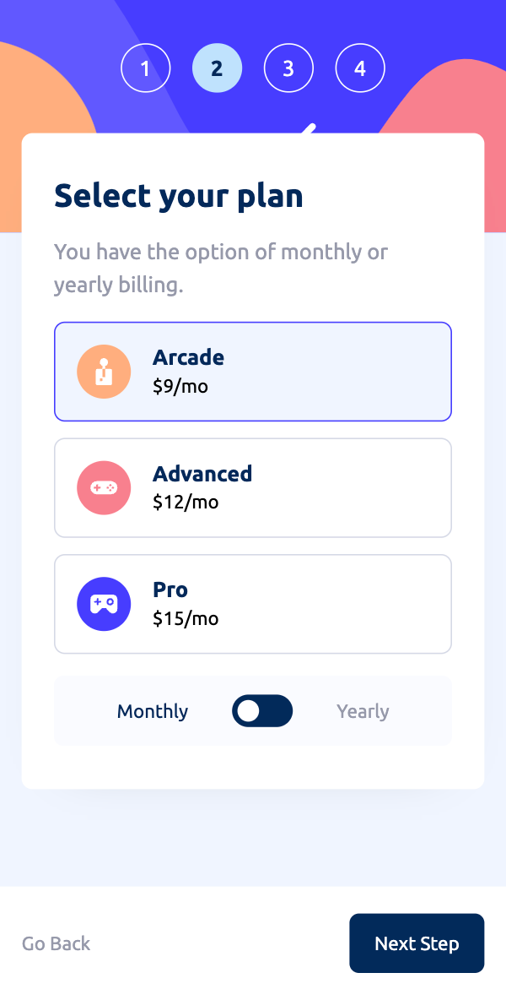
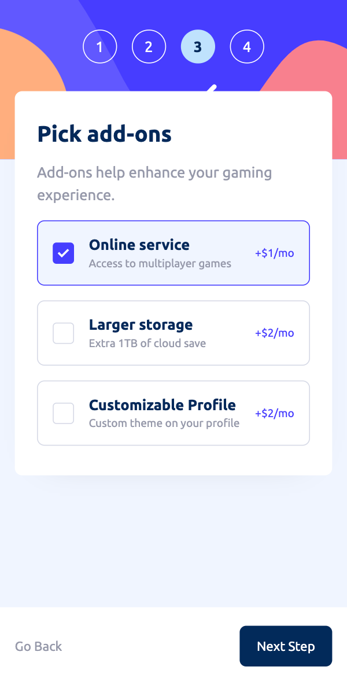
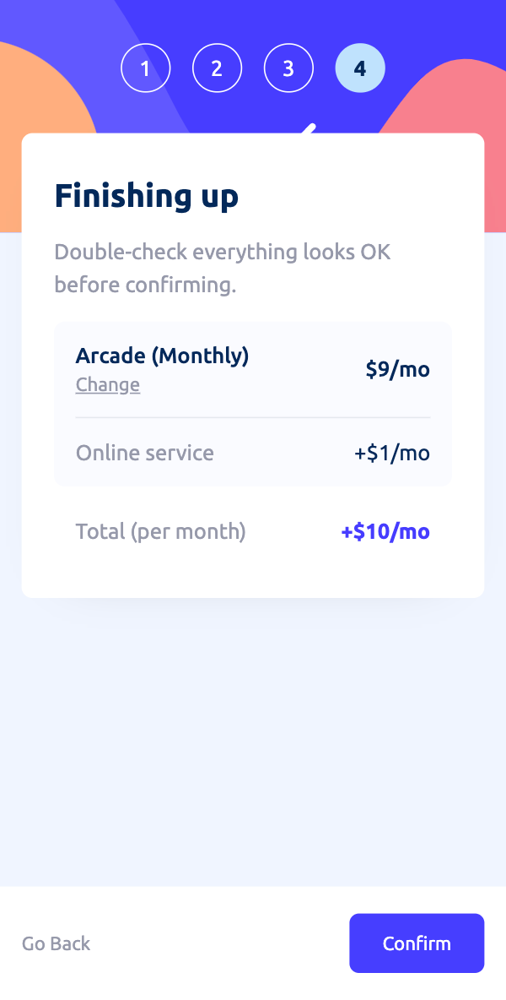
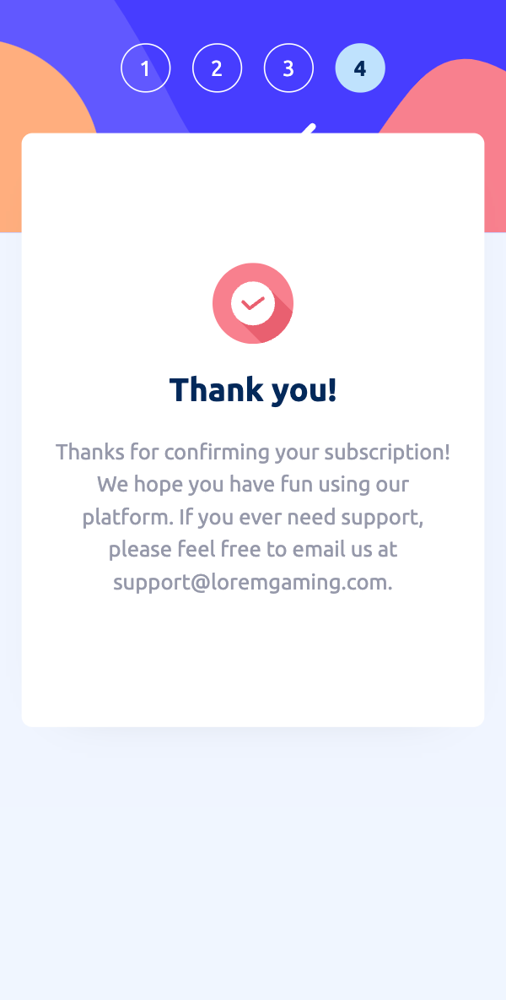

# Frontend Mentor - Multi-step form solution

This is a solution to the [Multi-step form challenge on Frontend Mentor](https://www.frontendmentor.io/challenges/multistep-form-YVAnSdqQBJ). Frontend Mentor challenges help you improve your coding skills by building realistic projects.

## Table of contents

- [Overview](#overview)
  - [The challenge](#the-challenge)
  - [Screenshot](#screenshot)
  - [Links](#links)
- [My process](#my-process)
  - [Built with](#built-with)
  - [What I learned](#what-i-learned)
  - [Useful resources](#useful-resources)
- [Author](#author)

## Overview

### The challenge

Users should be able to:

- Complete each step of the sequence &check;
- Go back to a previous step to update their selections &check;
- See a summary of their selections on the final step and confirm their order &check;
- View the optimal layout for the interface depending on their device's screen size &check;
- See hover and focus states for all interactive elements on the page &check;
- Receive form validation messages if:
  - A field has been missed &check;
  - The email address is not formatted correctly &check;
  - A step is submitted, but no selection has been made &check;

### Screenshot

#### Desktop version







#### Mobile version







### Links

- Solution URL: [Add solution URL here](https://your-solution-url.com)
- Live Site URL: [Multi-step from](https://aback-icicle.surge.sh)

## My process

### Built with

- Semantic HTML5 markup
- Flexbox
- CSS Grid
- CSS modules
- Mobile-first workflow
- [Sass](https://sass-lang.com/) - preprocessor scripting language for css
- [React](https://reactjs.org/) - JS library framework
- [Vite](https://vitejs.dev/) - local development server
- [Validator.js](https://www.npmjs.com/package/validator) - A library of string validators and sanitizers.

### What I learned

I learened form validation, its really important thing to learn in the web field.

here is an example for email validation:

```jsx
const emailHandler = (e) => {
  setInfo({ ...info, Email: "" });
  setInfo({ ...info, Email: e.target.value });
  if (validator.isEmail(e.target.value)) {
    setIsEmailValid(true);

    if (isNameValid && isNumberValid) {
      setIsInfoFormValid({ ...isInfoFormValid, isValid: true });
    }
  } else {
    if (e.target.value === "") {
      setEmailErrorMessage(nameErrorMessage);
    } else {
      setEmailErrorMessage("Incorrect email");
    }
    setIsEmailValid(false);
    setIsInfoFormValid({ ...isInfoFormValid, isValid: false });
  }
};
```

When the user start typing, the function will be triggered. The function will check the email using the validator package, and it will return true or false based on the user input.

### Useful resources

- [Udemy course by Maximilian Schwarzmüller](https://www.udemy.com/course/react-the-complete-guide-incl-redux/) - This helped me literally in evrey aspect in this challenge. All my react knowledge is from this course.
- [Kevin Powell](https://www.youtube.com/@KevinPowell) - This guy is a css master, he have videos for a lot of css problems and how to solve it the right way.

## Author

- LinkedIn - [Mateeb Alharbi](https://www.linkedin.com/in/mateeb-alharbi/)
- Frontend Mentor - [@Mateeb11](https://www.frontendmentor.io/profile/Mateeb11)
